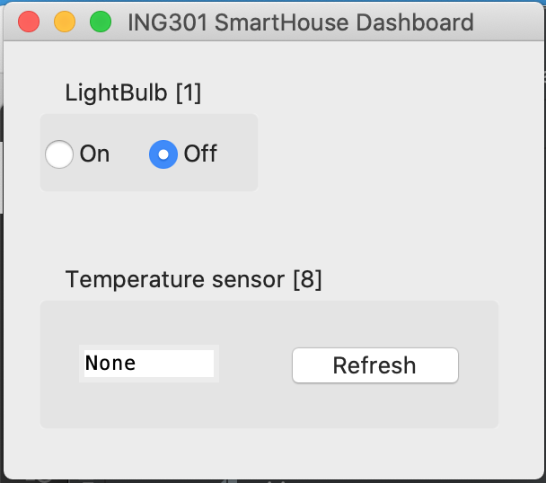

# ING301 prosjekt - Del D

I del D av prosjektet skal dere implementere klient-applikasjoner som bruker REST API for SmartHus sky-tjenesten som dere implementerte i Del C. Konkret skal det implementeres:

- en *dashboard (klient) applikasjon* som gjør det mulig å hente målinger fra sensorer og sette tilstanden på aktuatorer
- et *smarthus (klient) applikasjon* som simulerer de fysisk sensorer og aktuatorer i smarthuset og som sender målinger for sensorer og henter tilstand for aktuatorer 

Dashboardet og smarthus applikajsonen skal kommuniserere med hverandre ved å bruke endepunktene i REST API'et for sky-tjenesten.

## Setup og startkode

Start-koden for prosjektet finnes i dette github repository: 

https://github.com/selabhvl/ing301-projectpartD-startcode.git

some kan brukes som mal (**Use as Template**) som dere har gjort med startkode tidligere.

Startkoden inneholder egne klasser for aktuatorer og sensorer på klient-siden og er dermed _"uavhengig"_ av selve `smarthouse` systemet.  

Kodebasen for start-koden dekker altså bare klientene, og det forutsettes at en ferdig utviklet løsning av REST-APIet som beskrevet i 
del C er utviklet. Dere kan bruker deres egen løsning eller bruke vårt løsningsforslag:
Når dere sjekker ut dette prosjektet (etter å ha laget repository basert på templaten) kan dere enten plasere  det i en helt ny mapper, eller dere kan også legger det inn i deres eksisterende prosjekt (som [submodul](https://git-scm.com/book/en/v2/Git-Tools-Submodules)) og legge det ved siden av `smarthouse`-mappen, f.eks. i en mappe som heter `client`.

```bash
cd <smarthouse prosjekt>
git clone <part D repository> client
cd client
```


Husk at skytjenesten må kjøres i bakgrunnen (lytter på en port for HTTP forbindelser) for at de to klient-applikasjoner skal kunne kommunisere.

Som en forenkling av oppgaven skal vi kun fokusere på kontroll av to enheter fra demo smarthuset:

- Sensor: Temperatursensor (f.eks. uuid=`4d8b1d62-7921-4917-9b70-bbd31f6e2e8e`)
- Aktuator: Lyspære (LightBulb) (f.eks. uuid=`6b1c5f6b-37f6-4e3d-9145-1cfbe2f1fc28`)

Dere skal bruke [requests-biblioteket](https://requests.readthedocs.io/en/latest/) for å implementere bruk av REST API fra klient-applikasjonene.

## Dashboard klient-applikasjon
 
Start-koden for en dashboard applikasjonen med grensesnitt implementert ved bruk av [tkinter](https://docs.python.org/3/library/tkinter.html) finnes i filene `dashboard.py`, `dashboard_lightbulb.py`, samt `dashboard_temperaturesensor.py`. 

Dashboard-applikasjonen startes ved å kjøre Python-scriptet `dashboard.py` og grensesnittet ser ut som vist nedenfor:



### For Mac-brukere

> [!NOTE]
> For dere som bruker Mac OS X (og kanskje noen Linux distribusjoner) også vil dere sannsynligvis får en feilmelding som 
> ```
> ModuleNotFoundError: No module named '_tkinter'
> ```
> Dette er fordi at bibioteket som brukes for disse applikasjoner _TKinter_ ikke som standard er del av Python installasjoner
> under Mac OS. Du må derfor eksplisitt installere denne. 
> Den anbefalte måten er å bruke [Homebrew](https://brew.sh/) for dette. Hvis du ikke har Homebrew fra før av så må du installere den først før du kan kjøre:
> ```
> brew install python-tk@3.9
> ```
> Du leser riktig: Du bør bruke Python 3.9 siden nyere versjoner av Python er litt ustabilit i forhold til Tkinter. 
> Når Python 3.9 med TKinter er installert lager du en virtual environment:
> ```bash
> python3.9 -m venv .venv
> source .venv/bin/activate
> python -V # -> burde viser 3.9...
> ```
> i det virtuelle miljøet installerer du `requests` og så kan du starte dashbordet:
> ```bash
> pip install requests 
> python dashboard.py
> ```

## Oppgavebeskrivelse

## Dashboard klient-applikasjon

Følgende skal implementeres:

- I filen `dashboard_lightbulb.py` skal dere implementere metoden `refresh_btn_cmd` som kalles når brukeren trykker på `Refresh`-knappen og som skal hente temperaturen fra sky-tjenesten for temperatursensoren.

- I filen `dashboard_temperaturesensor.py` skal dere implementere metoden `lightbulb_cmd` som blir utført når brukeren velger `On` eller `Off` knappene som skal skal sette tilstanden på lyspæren via sky-tjenesten.

I filen `messaging.py` finnes klassene `SensorMeasurement` og `ActuatorState` med metoder som kan brukes for å konstruere body/payload i de requests som skal sendes til sky-tjenesten. 

I eksempler fra forelesninger med REST web-tjenseter finnes der også eksempler på bruk av `requests`-modulet.

https://github.com/selabhvl/ing301public/tree/main/examples/12_restapi_webservices

## Smarthus klient-applikasjon

Start-koden for en smarthus applikasjonen som skal simulere de fysiske enheter i et smarthus finnes i filene `smarthouse.py`, `smarthouse_lightbulb.py`, samt `smarthouse_temperaturesensor.py`. 

Smarthus-applikasjonen startes ved å kjøre Python-scriptet `smarthus.py` Dette programmet skriver output i shell`en.

Følgende skal implementeres:

- I filen `smarthouse_lightbulb.py` skal dere i `Actuator`-klassen implementere metoden `client` som skal hente tilstand for aktuatoren fra sky-tjenesten med et passende antall sekunders intervall. Videre skal dere implementere `run`-metoden som skal start en ny tråd som kjører `simulator`-metoden og en tråd som kjører `client`-metoden.

- I filen `smarthouse_temperature.py` skal dere i `Sensor`-klassen implementere metoden `client` som skal levere temperaturen til sky-tjenesten med passende antall sekunders intervall. Videre skal dere implementere `run`-metoden som skal start en ny tråd som kjører `simulator`-metoden og en tråd som kjører `client`-metoden.

`Sensor` og `Actuator`-klassen følger den samme modellen ved å ha en `client`-metode som kjører i en tråd og ivaretar kommunikasjon med sky-tjenesten og en `simulator`-metode som kjører i en annen tråd og simulerer den fysisks enheten som ligger til grunn.

Denne tutorial inneholder en mer grunnleggende introduksjon til tråd-programmering:

https://superfastpython.com/threading-in-python/ 

og spesielt kan dere lese om hvordan en metode/funksjon kan kjøres i en egen tråd her:

https://superfastpython.com/threading-in-python/#Example_of_Running_a_Function_in_a_Thread

## Test av systemet

Test systemet ved å kjøre sky-tjenesten sammen med klient-applikasjonene:

- Sjekk at når tilstand for lyspæren endres i dashboard så endres også tilstanden i smarthuset
- Sjekk at når temperaturen ender seg i smarthuset så endres også temperatur i dashboard etter trykk på Refresh-knappen.

## Levering av prosjekt

Følgende skal leveres

- Linke til github repository med implemetasjon av tjenesten
- Screen-shot som viser dashboard- og smarthus-applikasjonen

## Videre arbeid

Smarthus prosjketet kan utvikles videre i ulike retninger for de som måtte a lyst til dette

- Sette opp eks. Arduino/Raspberry Pi enheter for å få faktiske fysiske sensorer og aktuatorer
- Generalisere dashboard slik det kan lese inn en konfigurasjon av enheter fra sky-tjenesten
- Utvikle protokoll for registering av nye enheter i smarthuset
- Digital tvilling som viser romslig plassering av enheter samt målinger og tilstander
- Legge til sikkerhet
- Sette sky-tjenesten i drift på Azure, AWS, GCP eller tilsvarende
